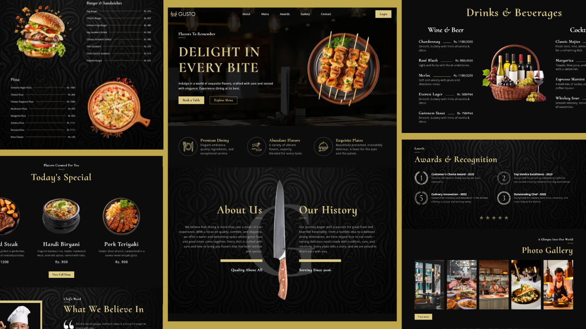

# 🍽️ Gusto - Restaurant Website



Gusto is a modern and elegant **restaurant website** built with **HTML, CSS, and JavaScript**. The project showcases a sleek landing page and a menu page with beautiful layouts, smooth animations, and interactive elements to enhance user experience.

## Features

- **Elegant Landing Page:** Modern, user-friendly design with visually appealing layouts.
- **Responsive design:** Fully responsive design across all devices.  
- **Menu Page:** Display of dishes with clean formatting and easy navigation.  
- **Scroll-to-Top Button:** Appears as you scroll down for easy navigation.  
- **Simple Animations:** Subtle and dynamic text effects to catch user attention to make the site more lively.  
- Fully built with **HTML, CSS, and JavaScript** — no frameworks required.

## Demo

Live site: [https://gusto-sb.vercel.app](https://gusto-sb.vercel.app)

## Installation

1. Clone the repository:
   ```bash
   git clone https://github.com/jatisusan/gusto.git

2. Open index.html in your browser.